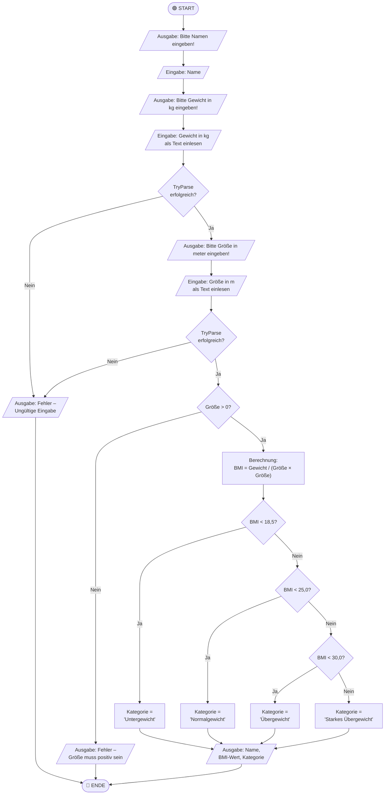

[](https://classroom.github.com/a/XwzfTBn-)
# 📋 Aufgabe: Programmablaufplan – BMI-Rechner

> **Fach:** C# Grundlagen  
> **Thema:** Programmablaufplan (PAP) & Kontrollstrukturen  
> **Schwierigkeit:** ⭐⭐ Mittel  
> **Bearbeitungszeit:** ca. 90 Minuten

---

## 🎯 Lernziele

Nach Abschluss dieser Aufgabe kannst du:

- [ ] Einen **Programmablaufplan** lesen und in C#-Code übersetzen
- [ ] Eingaben mit `TryParse` **validieren** und Fehler abfangen
- [ ] Komplexe **if-else-if-Ketten** sauber strukturieren
- [ ] Berechnungen mit `double` durchführen und Ergebnisse formatiert ausgeben
- [ ] Deinen Code **kommentieren** und verständlich gestalten

---

## 📖 Hintergrundwissen: Was ist ein Programmablaufplan?

Ein **Programmablaufplan (PAP)** – auch *Flussdiagramm* genannt – ist eine grafische Darstellung eines Algorithmus. Er zeigt, in welcher **Reihenfolge** Schritte ausgeführt werden und an welchen Stellen **Entscheidungen** getroffen werden.

### Symbole im PAP (DIN 66001)

| Symbol | Form | Bedeutung |
|--------|------|-----------|
| Start / Ende | Abgerundetes Rechteck (Oval) | Beginn oder Ende des Programms |
| Verarbeitung | Rechteck | Berechnung oder Zuweisung |
| Ein-/Ausgabe | Parallelogramm | `Console.ReadLine()` / `Console.WriteLine()` |
| Entscheidung | Raute | `if`-Bedingung (Ja/Nein) |
| Verbindungspfeil | Pfeil | Programmfluss |

> 💡 **Merke:** Im PAP gibt es **keine** Schleifen in dieser Aufgabe — nur sequenzielle Abläufe und Verzweigungen (Entscheidungen). Das entspricht genau dem, was wir bisher gelernt haben!

---

## 📐 Der Programmablaufplan

Der folgende PAP beschreibt das Programm, das du implementieren sollst:



---

## 📋 Aufgabenstellung

### Aufgabe 1 – PAP verstehen (📝 ohne Code)

Beantworte folgende Fragen **schriftlich als Kommentar** am Anfang deiner `Program.cs`-Datei:

1. Wie viele **Entscheidungsknoten** (Rauten) hat der PAP?
2. Unter welchen Bedingungen endet das Programm **frühzeitig**?
3. Warum wird `TryParse` statt `Convert.ToDouble()` verwendet?
4. Welchen Datentyp sollten `gewicht` und `groesse` haben, und warum?

### Aufgabe 2 – Implementierung

Implementiere den PAP als lauffähiges C#-Programm in `src/Program.cs`.

**Anforderungen:**

- [ ] Name des Benutzers einlesen (kein TryParse nötig – warum nicht?)
- [ ] Gewicht in kg als `double` einlesen mit `TryParse`-Validierung
- [ ] Körpergröße in Metern als `double` einlesen mit `TryParse`-Validierung
- [ ] Zusätzliche Prüfung: Größe muss **größer als 0** sein
- [ ] BMI berechnen: `BMI = Gewicht / (Größe * Größe)`
- [ ] BMI-Kategorie per `if-else-if`-Kette bestimmen (siehe Tabelle unten)
- [ ] Ergebnis **formatiert** ausgeben (BMI auf 2 Dezimalstellen gerundet)
- [ ] Sinnvolle **Kommentare** im Code

**BMI-Kategorien (WHO):**

| BMI-Wert | Kategorie |
|----------|-----------|
| < 18,5 | Untergewicht |
| 18,5 – 24,9 | Normalgewicht |
| 25,0 – 29,9 | Übergewicht |
| ≥ 30,0 | Starkes Übergewicht |

### Aufgabe 3 – Testen (🧪)

Teste dein Programm mit den folgenden Testfällen und dokumentiere die Ausgaben in der Datei `TESTPROTOKOLL.md`:

| Testfall | Name | Gewicht | Größe | Erwartete Kategorie |
|----------|------|---------|-------|---------------------|
| TC-01 | Max Mustermann | 70 | 1.75 | Normalgewicht |
| TC-02 | Lisa Beispiel | 50 | 1.70 | Untergewicht |
| TC-03 | Tom Tester | 95 | 1.75 | Übergewicht |
| TC-04 | Anna Admin | 120 | 1.75 | Starkes Übergewicht |
| TC-05 | Fehler-Test | abc | 1.75 | Fehlermeldung |
| TC-06 | Fehler-Test | 70 | -1 | Fehlermeldung (Größe ≤ 0) |

### Aufgabe 4 – Reflexion (💭 Denkaufgabe)

Beantworte diese Fragen ebenfalls in `TESTPROTOKOLL.md`:

1. Was passiert, wenn jemand `1,75` statt `1.75` als Größe eingibt? Teste es! Wie könnte man das lösen?
2. Warum ist die Reihenfolge der `if-else-if`-Bedingungen wichtig? Was würde passieren, wenn du mit `BMI < 30` anfängst?
3. Der PAP zeigt, dass `groesse > 0` geprüft wird **nach** TryParse. Warum macht diese Reihenfolge Sinn?

---

## 💡 Erwartete Programmausgabe

```
╔══════════════════════════════════╗
║        BMI-Rechner v1.0          ║
╚══════════════════════════════════╝

Bitte gib deinen Namen ein: Max Mustermann
Bitte gib dein Gewicht in kg ein: 70
Bitte gib deine Körpergröße in Metern ein: 1.75

──────────────────────────────────
📊 Ergebnis für Max Mustermann
──────────────────────────────────
BMI:       22,86
Kategorie: Normalgewicht
──────────────────────────────────
```

---

## 🏗️ Projektstruktur

```
csharp-pap-bmi/
├── README.md              ← Diese Datei (Aufgabenstellung)
├── TESTPROTOKOLL.md       ← Dein Testprotokoll (ausfüllen!)
└── src/
    └── Program.cs         ← Deine Implementierung
```

---

## ✅ Bewertungskriterien

| Kriterium | Punkte |
|-----------|--------|
| Aufgabe 1: Fragen korrekt beantwortet | 4 Punkte |
| TryParse korrekt angewendet (beide Eingaben) | 3 Punkte |
| Prüfung auf Größe > 0 | 1 Punkt |
| BMI-Berechnung korrekt | 2 Punkte |
| if-else-if-Kette korrekt und vollständig | 4 Punkte |
| Ausgabe formatiert (2 Dezimalstellen) | 2 Punkte |
| Alle 6 Testfälle dokumentiert | 3 Punkte |
| Reflexionsfragen beantwortet | 3 Punkte |
| Code sauber kommentiert | 2 Punkte |
| **Gesamt** | **24 Punkte** |

> 🎓 **Bestanden ab:** 14 Punkte (58%)

---

## 🚀 Los geht's!

1. Klone dieses Repository
2. Öffne `src/Program.cs` in Visual Studio oder VS Code
3. Lies dir den PAP **vollständig** durch, bevor du anfängst zu coden
4. Beantworte zuerst Aufgabe 1 als Kommentare
5. Implementiere dann Schritt für Schritt

> ❓ **Fragen?** Erstelle ein Issue in diesem Repository oder melde dich im Unterricht.
